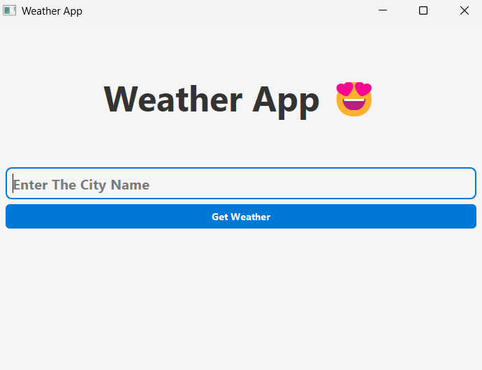

# ☁ PyQt5 Weather App

A desktop weather application built with *PyQt5* that displays real-time weather information based on user-input city. It uses a weather API to fetch live data and presents it with a responsive GUI.

---

## 📸 Screenshot



---

## 🚀 Features

- 🔍 Search weather by city name
- 🌡 Displays temperature, condition, wind speed, etc.
- 🎨 GUI built with *PyQt5*
- 🌐 Uses real-time data from an online Weather API

---

---

## 👨‍💻 Author

*Prince Jha*  
SY BSc IT | Python & PyQt Learner  
GitHub: [github.com/<your-username>](https://github.com/<your-username>)

---

## ⭐ Star This Repo

If you liked this project or found it useful, consider giving it a ⭐ to support future improvements!


## 🛠 Tech Stack

- *Python 3*
- *PyQt5* (GUI)
- *Requests* (HTTP requests)
- *Weather API* (e.g., OpenWeatherMap or WeatherAPI)

---

## 📦 Requirements

Install dependencies:

```bash
pip install pyqt5 requests